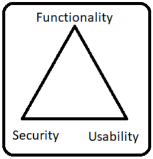

# Conceptos basicos de seguridad.
## CIA triad
El significado de sus siglas, CIA significa (Confindencialidad, integridad, disponibilidad), es un modelo de seguridad que ayuda a las organizaciones a establecer controles o políticas de seguridad en torno a los datos que maneja.
* confidencialidad 

Esta enfocado en restringir el acceso a personas no autorizadas. La confidencilida se preocupa por la creación de contraseñas fuertes y la descreción entre involucrados para no compartir información importante.
* Intgridad

La integridad es el esfuerzo constante por asegurar que la información sea confiable, constante y precisa, sin importar cúanto tiempo haya pasado desde su creación. 
Para asegurar la integridad de la información se encuentra la práctica de los respaldos regulares o copias de seguridad.
* Disponibilidad

La disponibilidad es fundamental para tener nuestra información siempre que se necesite acceder a ella. 

## Usability triangle

Triangulo de seguridad, funcionalidad y usabilidad.

 

El nivel de la seguridad se puede definir por la fortaleza de tres componentes.

* Funcionalidad: 

Es el conjunto de características proporcionadas por el sistema.

* Usabilidad:

Componentes utilizados para diseñar el sistema para facilitar su uso.

* Seguridad: 

Restricciones impuestas al acceso a los componentes del sistema.

La relación entre estos componentes se demuestra mediante el uso de un triángulo. "El aumento o la disminución de cualquiera de los componentes afecta automáticamente a los otros componentes".

## Riesgo

El riesgo consiste en las probabilidades de que una tenga vulnerabilidad de información y, por lo tanto pueda dañar la organización.
Por esto es fundamental gestional los riesgos para poder gestionar la seguridad de la información de una manera eficiente y responsable.

## MFA

La autenticación multifactor (MFA), consiste en un proceso de registro en varios pasos que requiere que los usuarios ingresen algo más de de informacion que simplemente una contraseña. 

Por ejemplo, junto con la contraña, los usuarios deberán ingresar un código que se envia a su correro electrónico. 

La autentificación multifactor actúa como una capa adicional de seguridad para evitar usuarios no autorizados accedan a dichas cuentas, incluso cuando se han robado la contraseña. Las empresas suelen utilizar MFA para validar identidades de usuarios y brindar acceso rápido y práctico  los usuarios autorizados.

La autenticaci;on multifactor es fundamental para la seguridad digital, ya que tanto para empresas como usuarios almacenan informaci;on confidencial en línea. 

## Vulnerabilidad 

La vulnerabilidad informática es cualquier fallo o error en el software o hardware que hace posible que un atacante comprometa la integriddad y confidencialidad de los datos que procesa en el sistema. Además, son una de las principales razones por las que una empresa pueda sufrir un ataque informatico a sus sistemas. Es donde entra la ciberseguridad.

## Amenaza 
Amenazas a la seguridad se refiere a la explotaci;on de una vulnerabilidad o falla que se utilizan para afectar la operatividad de un sistema.
Las amenazas informáticas pueden clasificarse.

1. Amenazas informáticas externas: 

Estas amenazas que provienen afuera de la organizacion. Estas amenazas incluyen virus, gusanos, troyanos, etc.

2. Amenazas informáticas internas: 

Son amenazas que se originan en la propia organización y pueden ser controladas hasta cierto punto por el departamento e TI. Estas amenazas incluyen el acceso no autorizado a los sistemas informaticos, el robo de datos etc.

Una amenaza en seguridad informática es la acción que se ejerce a través de la explotación de una vulnerabilidad, con el objeto de acceder a información confidencual o recursos financieros y electrónicos, entre otros.

## Impacto

La evaluación de de impacto de la protección de datos es una herramienta que determina el riesgo que existe de que los procesos de la organización impacten o comprometan la privacidad.'

El análisis de impacto en la seguridad es uno de los pasos más críticos a la hora de proteger las configuraciones. Su objetivo es analizar cuál será el impacto en la seguridad de cada cambio de configuración en la organización a ataques. Estos anális son realizados por equipos que entienden y conocen a profundidad el sistema de inforación y los riesgos potenciales.